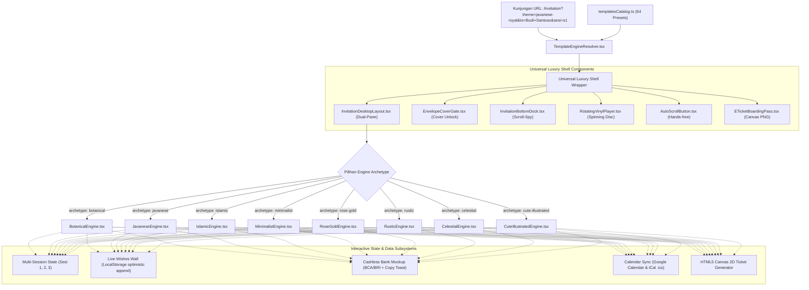

# HariKita: Dedicated Digital Invitation Engine Architecture Design
**Dokumen Spesifikasi Teknis (Spec Document)**  
**Tanggal:** 2026-09-09  
**Status:** PROPOSED - READY FOR USER REVIEW  
**Fokus Wilayah Pilot:** Kabupaten Kebumen (Mexolie Hotel, Grand Kolopaking, Pendopo Kabumian, Trio Azana)  
**Arsitektur Stack:** Next.js 15 (App Router) + TypeScript + Tailwind CSS v4 + daisyUI 5 + Lucide React + HTML5 Canvas Motion Engines + LocalStorage Telemetry Engine

---

## 1. Latar Belakang & Pernyataan Masalah

Dari hasil eksplorasi forensik mendalam (*deep-dive forensic deconstruction*) terhadap 60+ template pada platform referensi (**UndanganDigital.id** dan **HelloGuest.id**), ditemukan bahwa keunggulan undangan digital modern tidak hanya terletak pada pergantian warna latar belakang, melainkan pada **tata letak struktural (*bespoke layout geometry*)**, **sistem animasi mikro dinamis**, serta **fitur-fitur periferi interaktif kelas luxury**.

Pada prototipe awal HariKita:
1. Tampilan desktop melebar ke seluruh layar (*stretched layout*), kehilangan nuansa smartphone intimate.
2. Setiap tema masih menggunakan kartu generik daisyUI yang identik untuk jadwal acara, kisah cinta, dan galeri.
3. Belum tersedianya *floating peripherals* seperti *dock* menu melayang bersensor posisi (*scroll-spy*), piringan hitam audio berputar (*vinyl player*), tombol baca otomatis (*auto-scroll*), dan *boarding pass e-checkin ticket* yang dapat diunduh langsung menjadi file PNG.

### Tujuan Desain
1. Membangun **Universal Luxury Shell Architecture**:
   - `InvitationDesktopLayout.tsx`: Tampilan ganda (*dual-pane showcase*) di desktop monitor (panel kiri slideshow sinematik + panel kanan wadah HP 480px terpusat; 100vw di HP).
   - `EnvelopeCoverGate.tsx`: Tirai amplop pembuka dengan personalisasi nama tamu (`?to=...`) dan pemicu gestur audio resmi.
   - `InvitationBottomDock.tsx`: Floating glass dock melayang dengan 7 ikon dan deteksi *scroll-spy* aktif (`IntersectionObserver`).
   - `RotatingVinylPlayer.tsx`: Piringan hitam berputar beriringan dengan audio dan gelombang suara Lottie/SVG.
   - `AutoScrollButton.tsx`: Tombol auto-scroll mulus hands-free berbasis `requestAnimationFrame`.
   - `ETicketBoardingPass.tsx`: Drawer tiket e-checkin bergaya boarding pass maskapai + tombol download PNG via HTML5 Canvas.
2. Membangun **8 Bespoke Archetype Layout Engines**:
   - `BotanicalEngine.tsx`: Polaroid cards, floral corners bergoyang (`@keyframes botanicalSway`), kelopak bunga berterbangan.
   - `JavaneseEngine.tsx`: Gebyok ukir jati keraton, gerbang gunungan wayang terbuka (`@keyframes gununganKiri/Kanan`), prada gold.
   - `IslamicEngine.tsx`: Lengkungan kubah Maroko (*Moorish arch*), ornamen bintang 8, teks Arab kaligrafi Basmalah & Ar-Rum 21.
   - `MinimalistEngine.tsx`: Layout asimetris majalah editorial (*Vogue/Kinfolk*), hairline borders, tipografi haute couture.
   - `RoseGoldEngine.tsx`: Bevel cut corners mewah, bingkai foil emas berkilau (`@keyframes shimmer`), partikel debu emas.
   - `RusticEngine.tsx`: Tekstur kertas kraft/linen alami, stempel pos vintage, daun pampas kering, daun gugur perlahan.
   - `CelestialEngine.tsx`: Dark mode luxury, kartu kaca gelap transparan (*dark glassmorphism*), glowing border, kanvas bintang malam.
   - `CuteIllustratedEngine.tsx`: Chubby pill cards, maskot kartun cinta ceria, balon hati, dan terintegrasi Peta Kartun Kebumen.
3. Menyusun **Template Configuration Matrix (64 Template Registry)** di `src/lib/templates/templatesCatalog.ts` (8 varian spesifik per archetype).
4. Menyediakan **Live Theme Switcher Toolbar** untuk navigasi dan pengujian cepat seluruh 64 template secara instan.

---

## 2. Arsitektur Komponen & Alur Data

### 2.1 Diagram Alur Eksekusi Sistem Undangan

---

## 3. Spesifikasi Detail Universal Luxury Shell

### 3.1 `InvitationDesktopLayout.tsx`
* **Viewport Desktop (`min-width: 1024px`):**
  * Grid 2-kolom:
    * **Panel Kiri (50% Lebar Layar, Sticky 100vh):** Menampilkan latar belakang foto prewedding bergerak lambat (*Ken Burns slow zoom/pan*), monogram inisial pasangan beraksen emas, tanggal hari H, kotak hitung mundur waktu (*countdown*) besar, dan watermark eksklusif *"HariKita Hyperlocal Kebumen"*.
    * **Panel Kanan (50% Lebar Layar):** Berisi wadah terpusat dengan lebar tetap `max-w-[480px]`, berlatar belakang sesuai tema aktif, berbingkai bayangan halus (*shadow-2xl*), tempat tamu membaca isi undangan vertikal.
* **Viewport Mobile (`< 768px`):**
  * Panel kiri otomatis tersembunyi (`display: none`).
  * Panel kanan mengisi 100vw secara mulus (*edge-to-edge*) tanpa overflow horizontal.

### 3.2 `EnvelopeCoverGate.tsx`
* **Status Awal:** `fixed inset-0 z-50` mengunci scroll halaman (`document.body.style.overflow = 'hidden'`).
* **Konten Cover:**
  * Monogram logo animasi denyut halus (`@keyframes pulse`).
  * Subtitle "The Wedding of" / "Walimatul 'Ursy".
  * Nama Mempelai dalam tipografi display sesuai archetype.
  * Kartu personal tamu: "Kepada Yth. Bapak/Ibu/Saudara/i: [NamaTamu]".
* **Aksi Buka Undangan:**
  * Tombol berikon amplop terbuka.
  * Saat diklik: Cover meluncur ke atas (*slide-up exit*), scroll body dibuka kembali, musik otomatis berputar melalui gestur resmi, dan seluruh elemen periferi melayang dimunculkan.

### 3.3 `InvitationBottomDock.tsx`
* **Geometri & Letak:** Melayang di bawah tengah layar `fixed bottom-6 left-1/2 -translate-x-1/2 z-40`. Dilengkapi padding `pb-[env(safe-area-inset-bottom,16px)]` untuk iPhone notch bar.
* **Aestetika:** Frosted glassmorphism (`backdrop-blur-md bg-white/80 dark:bg-black/80 border border-white/20 shadow-2xl rounded-full px-5 py-2.5 flex items-center gap-4`).
* **Daftar Ikon:** Sampul (`#hero`), Mempelai (`#couple`), Acara (`#event`), Kisah (`#story`), Galeri (`#gallery`), Kado (`#gift`), Ucapan (`#rsvp`).
* **Scroll-Spy Engine:** Menggunakan `IntersectionObserver` untuk memantau section yang sedang aktif dan otomatis menyalakan highlight warna tema pada ikon terkait.

### 3.4 `RotatingVinylPlayer.tsx`
* **Tampilan:** Piringan hitam melayang dengan cover album bulat berputar halus (`@keyframes spin 12s linear infinite`).
* **Animasi Gelombang Suara:** Efek denyut gelombang suara melingkar memancar di sekeliling vinyl.
* **Interaktivitas:** Klik untuk jeda (disc membeku dengan badge "Paused") dan klik kembali untuk memutar.

### 3.5 `AutoScrollButton.tsx`
* **Tampilan:** Pill button melayang di pojok kiri bawah dengan ikon putar/jeda dan teks "Auto Scroll".
* **Mekanisme:** Loop `requestAnimationFrame` dengan laju 1.5px/frame. Otomatis menjeda saat layar disentuh manual oleh tamu.

### 3.6 `ETicketBoardingPass.tsx`
* **Trigger:** Tab vertikal di tepi layar (*"🎫 E-TIKET / QR CODE"*).
* **Modal Boarding Pass:** Kartu bergaya tiket penerbangan maskapai eksklusif dengan sobekan garis voucher (*perforated stub*), memuat:
  * Header prewed photo banner.
  * Nama Tamu & Kategori Undangan (VIP / Reguler).
  * Waktu Sesi Kedatangan & Lokasi Venue Kebumen.
  * QR Code Check-in Tamu.
* **Download PNG:** Engine Canvas 2D merender elemen menjadi file gambar PNG kualitas tinggi (`HariKita-ETicket-[NamaTamu].png`).

---

## 4. Spesifikasi Detail 8 Archetype Layout Engines

Setiap engine memiliki berkas mandiri dengan implementasi HTML/CSS yang khusus:

| Archetype Engine | Berkas Komponen | Geometri Card | Divider & Bingkai SVG | Kanvas Partikel | Tipografi Default |
|:---|:---|:---|:---|:---|:---|
| **1. Botanical Garden** | `BotanicalEngine.tsx` | Sudut membulat organik (`rounded-2xl`), polaroid tilt | `OrnamentFloralWreath.tsx` + 4 sudut bunga bergoyang | Kelopak bunga & daun gugur | *Playfair Display* + *Montserrat* |
| **2. Javanese Royal** | `JavaneseEngine.tsx` | Tekstur gebyok jati simetris, pilar ukir klasik | `OrnamentGunungan.tsx` (Animasi buka gerbang wayang) | Debu emas prada melayang | *Cinzel Decorative* + *Plus Jakarta Sans* |
| **3. Islamic Medina** | `IslamicEngine.tsx` | Lengkungan kubah Maroko (*Moorish Archway*) | `OrnamentMoroccanArch.tsx` + Bintang 8 + Basmalah | Kilau emas sejuk lembut | *Amiri Calligraphy* + *Outfit* |
| **4. Minimalist Noir** | `MinimalistEngine.tsx` | Asimetris majalah editorial (*Vogue/Kinfolk*) | `OrnamentMinimalLine.tsx` + Garis hairline 1px | Bersih (tanpa partikel) | *Cormorant Garamond* + *Inter* |
| **5. Rose Gold Luxury** | `RoseGoldEngine.tsx` | Bevel cut corners geometris berlian | `OrnamentGoldFoilFrame.tsx` + Shimmer border effect | Debu kristal emas mawar | *Alex Brush* + *Cinzel* + *Plus Jakarta Sans* |
| **6. Rustic Bohemian** | `RusticEngine.tsx` | Tekstur serat kraft linen, cap pos vintage | Pampas grass SVG + Stamp marks + Segel lilin | Daun kering musim gugur | *Bodoni Moda* + *Work Sans* |
| **7. Celestial Midnight** | `CelestialEngine.tsx` | Dark glassmorphism transparan (`bg-slate-950/70`) | Peta rasi bintang + Fase bulan + Pendaran neon | Bintang malam berkelip | *Syne* + *Plus Jakarta Sans* |
| **8. Cute Illustrated** | `CuteIllustratedEngine.tsx`| Chubby pill rounded (`rounded-3xl`), balon ucapan | Karakter kartun lucu + Balon hati + Rute peta kartun| Konfeti pastel & hati melompat | *Caveat* + *Quicksand* |

---

## 5. Matriks 64 Varian Template (`templatesCatalog.ts`)

Katalog memetakan 64 template (8 varian per engine):

1. **Botanical (8):** `autumnelle`, `tulivelle`, `fiorella`, `serenade-green`, `serenade-rose`, `serenade-moss`, `celestine`, `botanica-terracotta`.
2. **Javanese (8):** `javanese-royal`, `javanese-azurite`, `javanese-umber`, `javanese-ivory`, `javanese-crimson`, `javanese-golden`, `javanese-kebumen`, `javanese-pearl`.
3. **Islamic (8):** `medina-gold`, `emerald-syari`, `walimatul-ursy`, `al-fatih`, `salsabila`, `ar-rahman`, `nur-jannah`, `barakah-rose`.
4. **Minimalist (8):** `seraphicus`, `minimal-noir`, `celestial-odyssey`, `blanc-studio`, `harmony-gray`, `clay-peak`, `marble-mist`, `serenity-sky`.
5. **Rose Gold (8):** `rose-gold`, `glamour-grey`, `black-diamond`, `burgundy-bliss`, `golden-seafoam`, `amber-grace`, `blue-sapphire`, `gilded-cameo`.
6. **Rustic (8):** `cocoa-rustic`, `terracotta-sienna`, `bohemian-bliss`, `sienna-earth`, `golden-amber`, `celadon-charm`, `dusty-blush`, `rustic-pine`.
7. **Celestial (8):** `aeternum-vita`, `primus-noctis`, `lunar-melody`, `stellar-nova`, `midnight-blue`, `velvet-noir`, `aurora-glow`, `eclipse-gold`.
8. **Cute Illustrated (8):** `marielle-forest`, `alleya-sweet`, `manga-sweet`, `cartoon-maps-kebumen`, `pastel-joy`, `sweet-bubble`, `cotton-candy`, `doodle-love`.

---

## 6. Rencana Verifikasi & Penanganan Kasus Khusus (*Verification & Error Handling*)

1. **Safari Autoplay Policy:** Tombol gesture `"Buka Undangan"` menjamin audio web diputar tanpa blokir keamanan browser.
2. **Clipboard Access:** Fallback otomatis dari `navigator.clipboard` ke `document.execCommand` untuk perangkat lama.
3. **Canvas CORS Safety:** Elemen grafis untuk tiket boarding pass disematkan via inline SVG dan data URI untuk mencegah galat *tainted canvas*.
4. **Mobile Responsiveness:** Uji render pada lebar layar 360px, 390px (iPhone 14/15/16), 768px (iPad/Tablet), dan 1440px (Desktop Dual-Pane).
5. **Kompilasi TypeScript:** `npm run build` wajib menghasilkan 0 error di seluruh 64 preset tema dan modul terkait.
