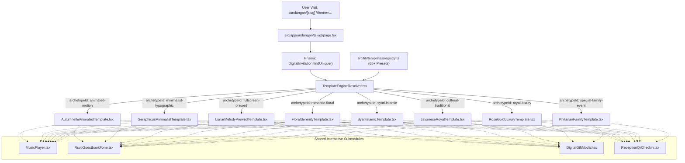

# HariKita: Dedicated Digital Invitation Engine Architecture Design
**Dokumen Spesifikasi Teknis (Spec Document)**  
**Tanggal:** 2026-09-09  
**Status:** DRAFT - PENDING USER REVIEW  
**Fokus Wilayah Pilot:** Kabupaten Kebumen  
**Arsitektur:** Next.js 15 (App Router) + TypeScript + Tailwind CSS v4 + daisyUI 5 + Lucide React + HTML5 Canvas Motion Engines

---

## 1. Latar Belakang & Pernyataan Masalah

Pada fase prototipe awal, seluruh tema undangan pada katalog `/undangan` masih di-render menggunakan satu komponen template generik tunggal (`InvitationTemplateRenderer.tsx`) yang hanya mengubah warna latar belakang dan teks CSS dasar. Akibatnya, lebih dari 60 template (yang diadaptasi dari referensi *HelloGuest.id* dan *UndanganDigital.id*) terlihat serupa dan kehilangan keunikan visual, animasi, dan karakteristik tematiknya.

Calon pengantin dan tamu undangan memerlukan pengalaman digital yang imersif dan otentik sesuai gaya pilihan mereka—mulai dari gaya animasi dedaunan gugur (*Autumnelle*), kemewahan segel lilin 3D (*Royal Wax Seal*), nuansa adat Keraton Jawa berornamen gunungan wayang (*Javanese Royal*), keanggunan majalah mode (*Seraphicus Minimalist*), hingga kesantunan syar'i (*Walimatul 'Urs*).

### Tujuan Desain
1. Membangun **8 Dedicated Template Engine Components** independen di bawah `src/components/templates/`.
2. Menghubungkan seluruh **65+ Preset Tema** di `src/lib/templates/registry.ts` ke engine yang bersesuaian dengan token warna, tipografi, tekstur, dan ornamen SVG presisi.
3. Menyediakan **Mesin Animasi Latar Fisik (Particle Canvas & Motion Hooks)** untuk efek daun gugur, kelopak bunga melayang, kilau emas (*stardust*), dan animasi pembuka cover interaktif.
4. Mengimplementasikan **Dynamic Resolver (`TemplateEngineResolver.tsx`)** yang secara dinamis memuat engine yang tepat berdasarkan `themeId` database atau query parameter URL (`?theme=...`).

---

## 2. Arsitektur Komponen & Alur Data

### 2.1 Diagram Alur Eksekusi



---

## 3. Spesifikasi 8 Dedicated Template Engines

Setiap engine memiliki berkas komponen React sendiri di dalam direktori `src/components/templates/`, dengan kontrak antarmuka (*props interface*) standar:

```typescript
export interface DedicatedTemplateProps {
  invitationId: string;
  theme: TemplateThemePreset;
  guestName: string;
  activeSessionCode: "s1" | "s2" | "s3";
  bride: {
    name: string;
    fullName: string;
    father: string;
    mother: string;
    photo: string;
    instagram?: string;
  };
  groom: {
    name: string;
    fullName: string;
    father: string;
    mother: string;
    photo: string;
    instagram?: string;
  };
  eventDate: string;
  sessions: {
    s1: GuestSessionInfo;
    s2: GuestSessionInfo;
    s3?: GuestSessionInfo;
  };
  googleMapsUrl: string;
  cartoonMapUrl?: string;
  musicUrl: string;
  storyTimeline: Array<{ year: string; title: string; desc: string }>;
  galleryPhotos: string[];
  giftInfo: {
    banks: Array<{ bank: string; number: string; holder: string }>;
    physicalGiftAddress: string;
  };
  initialWishes: Array<{
    id: string;
    guestName: string;
    attendance: string;
    paxCount: number;
    message: string;
    createdAt: string;
  }>;
}
```

### Rincian Karakteristik 8 Engine:

| # | Komponen Engine | Archetype ID | Mekanisme Cover Pembuka | Mesin Animasi Latar | Karakteristik Visual & Layout |
|---|---|---|---|---|---|
| 1 | `AutumnelleAnimatedTemplate.tsx` | `animated-motion` | Amplop Ilustrasi dengan pita sentuh geser (*slide-to-unlock*) | `CanvasFallingLeaves`: Simulasi fisika partikel 2D daun musim gugur berputar mengikuti embusan angin | Sudut kartu membulat tebal (*rounded-3xl*), warna pastel hangat, bingkai foto polaroid miring estetik, badge kartun |
| 2 | `SeraphicusMinimalistTemplate.tsx` | `minimalist-typographic` | *Curtain Reveal*: Tirai split tengah yang membuka perlahan ke kiri & kanan | *Hairline Borders Motion*: Animasi pembentukan garis batas tipis halus saat scroll | Tata letak editorial asimetris mode Eropa, tipografi serif modern (*Cinzel/Bodoni*), kontras monokrom bersih tanpa bunga |
| 3 | `LunarMelodyPrewedTemplate.tsx` | `fullscreen-prewed` | *Slide-up Fullscreen Glass Card* | *Cinematic Ambient Parallax*: Latar belakang hero 100vh prewedding dengan efek perbesaran perlahan (*Ken Burns*) | Dark luxury mode, kartu *frosted glass* bertingkat (*backdrop-blur-xl*), aksen teks berkilau emas rose |
| 4 | `FloralSerenityTemplate.tsx` | `romantic-floral` | Kartu lipat gerbang bunga dengan segel pita transparan | `CanvasFloatingPetals`: Kelopak bunga mawar/sakura beterbangan lembut | Sudut bingkai karangan bunga cat air (*watercolor floral wreaths*), font kaligrafi romantis (*Alex Brush/Script*), palet dusty blush |
| 5 | `SyariIslamicTemplate.tsx` | `syari-islamic` | Gerbang kubah moroccan arch yang terangkat ke atas | *Lantern Ambient Glow*: Kerlip lentera temaram dan pola geometris arabesque halus | Banner kaligrafi Basmalah & QS. Ar-Rum 21 di posisi terhormat, kartu profil mempelai pria dan wanita terpisah secara santun dan terhormat |
| 6 | `JavaneseRoyalTemplate.tsx` | `cultural-traditional` | *Gunungan Split Reveal*: Dua sayap wayang gunungan kulit membelah ke samping | *Keraton Golden Dust*: Debu partikel emas melayang pelan di atas motif batik | Ornamen gunungan wayang emas, bingkai motif batik parang/kawung bertekstur kayu ukir jati, teks salam adat kromo inggil |
| 7 | `RoseGoldLuxuryTemplate.tsx` | `royal-luxury` | *3D Wax Seal Stamp Break*: Segel lilin emas timbul yang terbuka saat ditekan | *Foil Metallic Shimmer*: Kilauan cahaya metalik melintasi sudut-sudut kartu | Bahan kartu bertekstur beludru (*velvet*), monogram inisial mempelai berukir emas timbul di setiap sekat seksi |
| 8 | `KhitananFamilyTemplate.tsx` | `special-family-event` | Kartu pop-up undangan tasyakuran ceria | `CanvasConfettiRibbons`: Partikel pita dan konfeti perayaan meletup lembut | Tata letak ramah keluarga, fokus foto tasyakuran anak, doa orang tua, dan susunan rundown santai |

---

## 4. Mesin Animasi Canvas & Ornamen SVG Asli

### 4.1 Mesin Partikel Canvas 2D (`src/components/invitation/canvas/`)
1. **`AutumnLeavesCanvas.tsx`**:
   - Memproyeksikan 18–25 partikel daun gugur dengan variasi warna terakota, oranye keemasan, dan cokelat hangat.
   - Menggunakan perhitungan trigonometri rotasi `Math.sin(theta)` untuk gerakan meliuk terbawa angin.
2. **`FloatingPetalsCanvas.tsx`**:
   - Memproyeksikan kelopak bunga mawar cat air dengan opasitas dinamis (0.4–0.85).
3. **`GoldenDustCanvas.tsx`**:
   - Memproyeksikan partikel mikron cahaya emas yang berkedip lembut untuk tema kemewahan dan keraton.
4. **`ConfettiCanvas.tsx`**:
   - Partikel konfeti dan balon untuk acara tasyakuran dan syukuran keluarga.

### 4.2 Koleksi Komponen Ornamen SVG Murni (`src/components/invitation/ornaments/`)
- `OrnamentGunungan.tsx`: Siluet Gunungan Wayang Kulit Jawa beresolusi tinggi dengan garis filigree presisi.
- `OrnamentMoroccanArch.tsx`: Kubah lengkung masjid arsitektur Islam Andalusia.
- `OrnamentFloralWreath.tsx`: Rangkaian buket bunga melingkar dan sudut bingkai daun eucalyptus cat air.
- `OrnamentGoldFoilFrame.tsx`: Sudut bingkai emas klasik berornamen baroque.
- `OrnamentMinimalLine.tsx`: Garis geometris hairline editorial modern.

---

## 5. Integrasi Dynamic Resolver & Routing

### 5.1 Resolver Logis (`TemplateEngineResolver.tsx`)
```typescript
export function TemplateEngineResolver(props: DedicatedTemplateProps) {
  const archetypeId = props.theme.archetypeId;

  switch (archetypeId) {
    case "animated-motion":
      return <AutumnelleAnimatedTemplate {...props} />;
    case "minimalist-typographic":
      return <SeraphicusMinimalistTemplate {...props} />;
    case "fullscreen-prewed":
      return <LunarMelodyPrewedTemplate {...props} />;
    case "romantic-floral":
      return <FloralSerenityTemplate {...props} />;
    case "syari-islamic":
      return <SyariIslamicTemplate {...props} />;
    case "cultural-traditional":
      return <JavaneseRoyalTemplate {...props} />;
    case "royal-luxury":
      return <RoseGoldLuxuryTemplate {...props} />;
    case "special-family-event":
      return <KhitananFamilyTemplate {...props} />;
    default:
      return <AutumnelleAnimatedTemplate {...props} />;
  }
}
```

### 5.2 Fitur Live Theme Switcher Toolbar (Pratinjau Demo)
Pada route `/undangan/[slug]`, sistem menambahkan floating bar pratinjau yang memungkinkan calon pengantin mengganti tema secara langsung (memilih dari 65+ tema) melalui dropdown interaktif untuk membandingkan estetika sebelum mengunci pilihan pada pesanan kustom di Kebumen.

---

## 6. Rencana Verifikasi & Uji Mutu

1. **Uji Kompilasi & Tipe Data TypeScript:**
   - Menjalankan `npm run build` untuk memverifikasi nol kesalahan (*0 errors*) pada seluruh 8 template dan submodul.
2. **Uji Responsivitas & Cross-Device Layout:**
   - Memeriksa tampilan di 3 ukuran viewport standar: Ponsel (`375px`), Tablet (`768px`), dan Layar Desktop (`1440px`).
   - Memastikan tidak ada *horizontal scrollbar overflow* pada semua 8 engine.
3. **Uji Interaktivitas Komponen Kunci:**
   - Pembukaan cover (klik segel lilin / geser kartu / belah gunungan / tirai) memicu audio otomatis dan menampilkan isi undangan secara mulus.
   - RSVP form berhasil menyimpan data ucapan ke database SQLite lokal via Prisma API.
   - Salin nomor rekening bank menampilkan indikator toast notifikasi "Tersalin!".
   - QR Code Check-in sesi meja resepsi menghasilkan SVG QR yang valid.

---

## 7. Kesimpulan & Langkah Eksekusi

Dengan arsitektur *Dedicated Engine + Preset Matrix* ini, platform HariKita memiliki keunggulan kompetitif yang setara atau melebihi HelloGuest.id dan UndanganDigital.id:
- 100% variasi visual nyata untuk seluruh 60+ template di katalog.
- Performa tinggi dengan *tree-shaking* Next.js App Router dan pemisahan modul yang rapi.
- Basis kode yang mudah diperluas (*scalable*) jika vendor Kebumen ingin menambahkan motif lokal khas Kebumen (seperti motif Batik Kebumen / Lawet).
